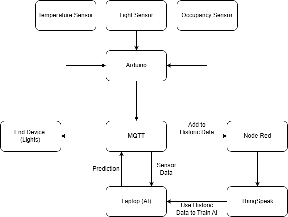

# IoT-Smart-Home-System

This is a smart home control system that uses IoT sensors to automate home appliances such as lights and curtains based on environmental conditions and user habits. The system is built using Arduino with sensors, AI implemented with python, ThingSpeak, Node-Red, and MQTT

Here is a general representation of the system:


## Arduino
The Arduino is used to collect data from sensors and send out this data to an MQTT server. The sensors include temperature, light, and motion sensors. The Arduino code is written in C++ and uses the Arduino IDE.

## MQTT
MQTT is a lightweight messaging protocol that is used to send data between different devices. In this system, the Arduino sends data to the MQTT server, that is later sent to both the AI algorithm and ThingSpeak through Node-Red.

## ThingSpeak
ThingSpeak is a cloud-based platform that allows users to create and manage IoT projects. It provides a simple way to collect and visualize data from IoT devices. In this system, ThingSpeak is used to visualize the data collected from the Arduino to serve as the historic data used in training the AI model.


## Node-Red
Node-Red is a visual programming tool that allows users to create flows of data between different devices. In this system, Node-Red is used to receive data from the MQTT server and send it to ThingSpeak.

You will need to install Node-Red on your computer and import the "flow.json" file. You will also need to update the MQTT server address and port in the flow.

## AI
The AI is implemented using python and with RandomForestClassifier from the sklearn.ensemble library. The AI is trained on the historic data collected from ThingSpeak and is used to predict the future behavior of the lights which it publishes back to the MQTT server.


# Running the Program
## Arduino Setup:
Using the schematic below, connect the sensors to the Arduino board and update the MQTT information in the code. Make sure to connect the power supply to the Arduino board and upload the main.ino file to the Arduino board. After which you can run the program. 

Here is a general representation of the wiring required:


## MQTT Setup:
You will need to install the MQTT client on your computer. PolyU's own MQTT server is used in this system, however, any MQTT server can be used. 

## ThingSpeak Setup:
You will need to create an account on ThingSpeak and create a new channel. You will need to add the fields that you want to visualize. After that you can start collecting data from the Arduino.

Here are the channel settings used in this system:


## Node-Red Setup:
You will need to install Node-Red on your computer and import the "flow.json" file. You will also need to update the MQTT server address and port in the flow as well as the ThingSpeak API key. After that you can deploy the flow.

Here is the Node-Red flow used in this system:


## AI Setup:
You will need to install the required python libraries by running this command:
```
pip install -r requirements.txt
```
After that you need to update the MQTT and ThingSpeak information. The program is now ready to run. You should see the AI predicting the future behavior of the lights and sending it back to the MQTT server. 

Here is an example output from the AI model:


The data appering on ThingSpeak:


